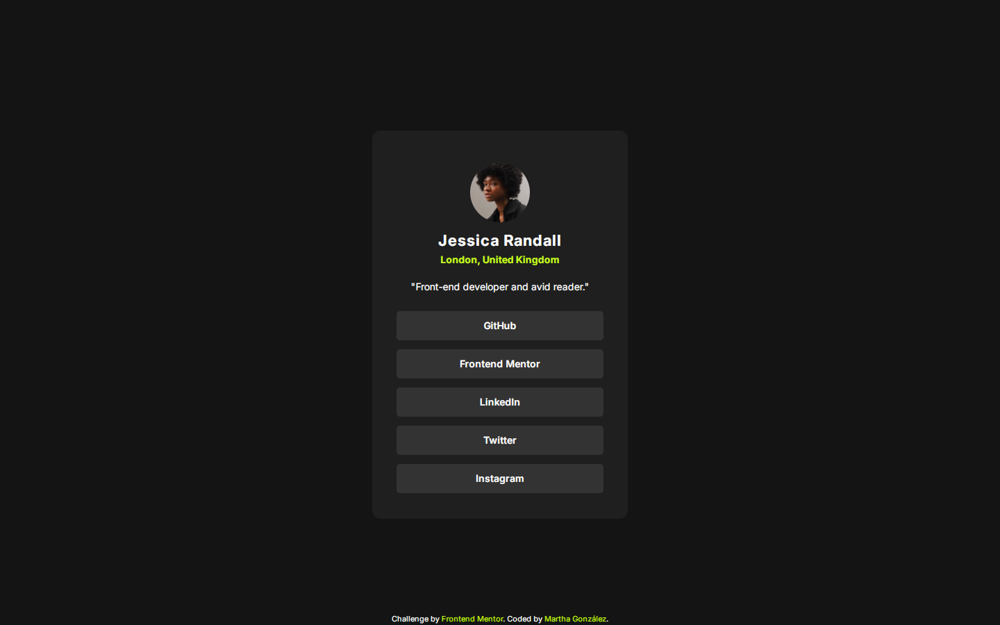

# Frontend Mentor - Social links profile solution

This is a solution to the [Social links profile challenge on Frontend Mentor](https://www.frontendmentor.io/challenges/social-links-profile-UG32l9m6dQ). Frontend Mentor challenges help you improve your coding skills by building realistic projects. 

## Table of contents

- [Overview](#overview)
  - [The challenge](#the-challenge)
  - [Screenshot](#screenshot)
  - [Links](#links)
- [My process](#my-process)
  - [Built with](#built-with)
  - [What I learned](#what-i-learned)
  - [Continued development](#continued-development)
  - [Useful resources](#useful-resources)
- [Author](#author)
- [Acknowledgments](#acknowledgments)

## Overview

### The challenge

Users should be able to:

- See hover and focus states for all interactive elements on the page

### Screenshot

### Links

- Solution URL: [Repository](https://github.com/margga88/Social-links-profile)
- Live Site URL: [Live Here](https://margga88.github.io/Social-links-profile/)

## My process

### Built with

- Semantic HTML5 markup
- CSS custom properties
- Flexbox
- Mobile-first workflow
- Cube CSS methodology

### What I learned

Taking the advice I've been receiving from the Frontend Mentor, I've applied most of the suggestioons, but especially the following:

- **Cube CSS methodology**: I was suggested on my first project to start working under this methodology, which I didn't understand quite at the start, but then I've realized that I've unconsciously been applying it in part. Unfortunately, the first examples I took weren't that clear and I didn't get to apply this well on my previous project, until I finally hit with a good source that helped me.

I loved applying it as soon as I understood it, and it kept my code cleaner to read and understand, as well as reusable which cut off the need for unnecessary code to solve the problem.

- **Mobile-first workflow**: This was yet, another suggestion. I've been used to code mainly for desktops, so starting from mobile was quite an experience, some very good parts like the previous point, on avoiding unnecessary code, and some complicated like the screen sizes and queries, but that I saw easier at the end of the project than if these were written starting from the desktop size.

### Continued development

- I would really like to keep practicing these concepts on future projects.

### Useful resources

- [CUBE CSS](https://cube.fyi/#what-does-cube-css-stand-for) - Quite helpful in order to understand the Cube CSS methodology.

## Author

- Frontend Mentor - [@margga88](https://www.frontendmentor.io/profile/margga88)

## Acknowledgments

I would like to thank the community of Frontend Mentor for their advice.
